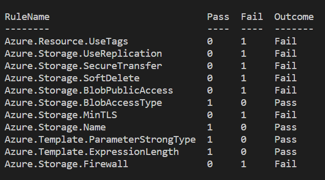
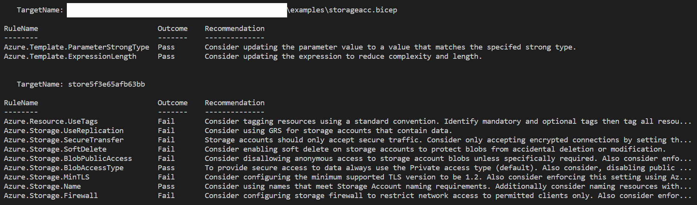

# PSRule - Blog Post

## Introduction

One of the fundamental ideas of DevOps is to combine the best practices from both worlds (infrastructure and development) and to learn from each other. Which means applying the concept of testing to our Infrastructure As Code (Bicep, Arm, etc). However, it can sometimes be tricky to know where to start and what tools are available to you. This blog post will be apart of a series of posts which will shows you how to start, what tools to use and why.

> *Note:*  This post will focus on providing tips for testing Bicep & ARM templates

## Testing Infrastructure As Code (IAC)

### Why

Before getting into the tooling and principles, let's start with `why should I test my IAC`. It does require some setup and a CICD pipeline (Github actions or Azure DevOps pipelines, etc) so why should I bother?

> Writing IAC templates can be complicated and we're all human. What if there's a typo, an incorrectly formatted JSON or Bicep module? These templates are meant to be shared out and reusable, so if there's a bad change merged in, the impact could be wide spread. There's a lot of talk about `shifting to the left`. This is a great example of this saying. We can move testing and validation on the IAC template and how they're consumed into our pipeline checks so anyone developing new templates or leveraging the existing templates get additional validation and feedback. This can increase the success rate and ease of using IAC.
> Consider the perspective of a consumer of these IAC templates. They didn't write them and this might be their first time using an IAC template. When you're using trying to use the IAC templates, getting feedback, examples and validation can help provide guidance and support to ensure that they're successful.

### How

There's a few different levels to testing IAC templates, the below table explains the levels:

| Level | Title | Description | How |
| -- | -- | -- | -- |
| Basic | Template validation | For IAC templates to work, they need to be valid. This could be as simple as checking the JSON structure for an ARM template and Parameter file. Or running the `bicep build` command to verify the bicep modules can correctly render into an ARM template. | - Bicep: Use `bicep build` on all `.bicep` files in the repository (find the files and do a foreach loop). <br> - ARM: Validate the ARM template and Parameter file is valid JSON. |
| Intermediate | Compare against the Well Architected Framework (WAF) | By Validating the IAC templates pass the standards outlined in the WAF it enables organisations to analyize their templates for best practices against the 5 WAF pillars (cost, security, reliability, operational excellence and performance). These findings can help to improve the quality of your IAC templates and help detect security or reliability risks before they're implemented (`by testing on the left (in the pipeline)`). | ARM & Bicep: [PSRule For Azure](https://azure.github.io/PSRule.Rules.Azure/about/). |
| Advanced | Validate IAC against your organisations standards | Each organisation has a different set of recommendations and standards. However it can be challenging to enforce these standards. For the most part these standards are either enforced in the IAC template or just documented. What if there was a tool that allows you to create rules to help enforce these standards (for free?!) | ARM & Bicep: [PSRule](https://microsoft.github.io/PSRule/v2/quickstart/standalone-rule/). |

In this blog post we're going to focus on using **PSRule for Azure**. A blog post will be written in the future for **PSRule**, however for more information, please use the link provided below.

### PSRule For Azure - (Intermediate)

So we now know that PSRule for Azure can verify our IAC templates against best practices. But what is it scanning for? Well, it includes over 260 rules that it evaluates for. For a list of what is evaluated [click here](https://azure.github.io/PSRule.Rules.Azure/en/rules/module/).

Finally, let's dive into how to use this tool locally!

#### Requirements

The following platforms are supported:

- Windows PowerShell 5.1 with .NET Framework 4.7.2 or greater.
- PowerShell 7.2 or greater on MacOS, Linux, and Windows.

#### Step 1 - Installation

PSRule for Azure can be installed locally by running the following commands in a PowerShell terminal:

To install PSRule for Azure for the current user use:

```powershell
Install-Module -Name 'PsRule' -Repository PSGallery -Scope CurrentUser -Force
Install-Module -Name 'PSRule.Rules.Azure' -Repository PSGallery -Scope CurrentUser -Force
```

To update these modules for the current user use:

```powershell
Update-Module -Name 'PSRule'
Update-Module -Name 'PSRule.Rules.Azure'
```

> *Note:* For the full installation instructions (local, Azure Devops & GitHub) use this [link](https://azure.github.io/PSRule.Rules.Azure/install-instructions/#installation)

#### Step 2 - Demo Setup

Now that the tool is installed we can start preparing to scan our IAC templates. Below is the code for the template I will be scanning in this demo ([link](https://raw.githubusercontent.com/Azure/azure-quickstart-templates/master/quickstarts/microsoft.storage/storage-account-create/main.bicep)):

```bicep
// Deploy storage account
@description('Storage Account type')
@allowed([
    'Premium_LRS'
    'Premium_ZRS'
    'Standard_GRS'
    'Standard_GZRS'
    'Standard_LRS'
    'Standard_RAGRS'
    'Standard_RAGZRS'
    'Standard_ZRS'
])
param storageAccountType string = 'Standard_LRS'

@description('Location for the storage account.')
param location string = resourceGroup().location

@description('The name of the Storage Account')
param storageAccountName string = 'store${uniqueString(resourceGroup().id)}'

resource sa 'Microsoft.Storage/storageAccounts@2021-06-01' = {
name: storageAccountName
location: location
sku: {
    name: storageAccountType
}
kind: 'StorageV2'
properties: {}
}
```

This file is available locally on my device in a folder called `examples`. Before we can test the Bicep module we need to test create a file called `ps-rule.yaml` with the following content:

```yaml
## YAML: Enable expansion for Bicep source files.
configuration:
  AZURE_BICEP_FILE_EXPANSION: true
```

#### Step 3 - Scanning a template

Now that everything is installed and setup, let's scan some IAC templates! To scan IAC templates in a folder you can use the following command:

```PowerShell
Invoke-PSRule -InputPath 'examples/' -Module 'PSRule.Rules.Azure' -As Summary
```

This provides a summary of what rules were evaluated against the IAC template in your `InputPath` (the example uses the `examples/` directory).



This provides a great overview and insights into the health of all of your IAC templates. But, let's dive a little deeper and look for results for each template.

```PowerShell
Invoke-PSRule -InputPath 'examples/' -Module 'PSRule.Rules.Azure'
```

By default the command will output a list of findings:



Out of the box we've got a set of recommendations for this template. It's that easy. We can then read through the list of recommendations and uplift our IAC.

In some some instances you may need to exclude a rule from being assessed or suppress the rule for a specific resource. 

- [Exclude Or Suppress](https://microsoft.github.io/PSRule/v2/faq/#how-do-i-ignore-a-rule)
- [Suppression Groups](https://microsoft.github.io/PSRule/v2/concepts/PSRule/en-US/about_PSRule_SuppressionGroups/)

> *Note:* For additional testing instructions: [bicep](https://azure.github.io/PSRule.Rules.Azure/using-bicep/) or [ARM](https://azure.github.io/PSRule.Rules.Azure/using-templates/)

### Next Steps

The demo provides a quick walkthrough on running PSRule for Azure locally, but what else can I do with it?

- [Azure DevOps Pipelines](https://azure.github.io/PSRule.Rules.Azure/creating-your-pipeline/)
- [GitHub Actions](https://azure.github.io/PSRule.Rules.Azure/creating-your-pipeline/)
  - [Visualise PSRule results in GitHub StaticCode Analysis](https://microsoft.github.io/PSRule/v2/analysis-output/)
- [VSCode Extension](https://microsoft.github.io/PSRule/v2/#visual-studio-code-extension)
- [All Other CICD Systems](https://microsoft.github.io/PSRule/v2/scenarios/validation-pipeline/validation-pipeline/)
- [Publish Results to Azure Monitor](https://azure.github.io/PSRule.Rules.Azure/setup/setup-azure-monitor-logs/)

> *Tip:* The benefit of publishing the PsRule results to Azure Monitor is that you can build a workbook to visualise how your IAC template comply against WAF best practices and any improvements over time!

### PSRule - (Advanced)

PsRule allows you to write your own rules. This is a great way to validate naming conventions and organisation standards, before resources are deployed. This will be covered in more details in a future post, but for more information: https://microsoft.github.io/PSRule/v2/scenarios/azure-resources/azure-resources/

## Additional Documentation

If you're interested in learning more about PSRule use the below links:

- [PSRule](https://microsoft.github.io/PSRule/v2/quickstart/standalone-rule/)
- [PSRule for Azure](https://azure.github.io/PSRule.Rules.Azure/about/)
- [Azure - WAF](https://docs.microsoft.com/en-us/azure/architecture/framework/)
- [PSRule For Azure - Quick Start Repo](https://github.com/Azure/PSRule.Rules.Azure-quickstart)

## Kudos

These tools are written and maintained by [Bernie White](https://www.linkedin.com/in/bernie-white/). If you're interested in getting involved in the projects you can start by going here [PSRule For Azure](https://github.com/Azure/PSRule.Rules.Azure/blob/main/CONTRIBUTING.md)  | [PSRule](https://github.com/microsoft/ps-rule/blob/main/CONTRIBUTING.md)